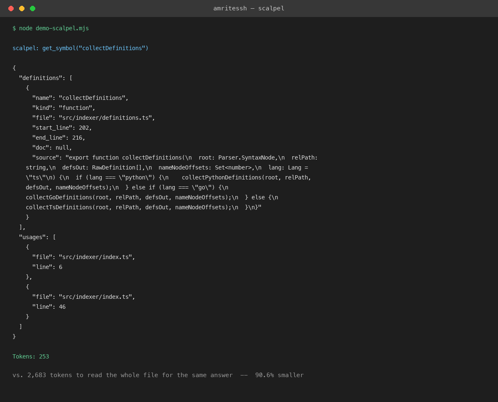

# scalpel

[](https://www.npmjs.com/package/@amritessh/scalpel)
[](https://www.npmjs.com/package/@amritessh/scalpel)

**Your agent asks "where is `collectDefinitions` defined?" Here's the same question, answered two ways, on this exact codebase:**



That's not a mockup — it's real output from running this tool against its own source. Same answer, 90% fewer tokens, because it never reads the file it doesn't need.

## What it does

An MCP server that gives an agent `get_symbol(name)` instead of a whole file. It returns just the definition span and its usages — nothing else gets read.

```bash
npm install -g @amritessh/scalpel

# index a repo (lang: ts | python | go, default ts)
scalpel-index /path/to/repo /path/to/repo/.scalpel/index.db [lang]

# run the MCP server over stdio
scalpel /path/to/repo /path/to/repo/.scalpel/index.db
```

Point an MCP client at it (stdio transport, args: `<repoPath> <dbPath>`). For Claude Code:

```bash
claude mcp add scalpel -- scalpel /path/to/repo /path/to/repo/.scalpel/index.db
```

## How it compares

Measured against real, installed competitors — not a straw-man "read everything" baseline (zod/TypeScript, n=40 questions):

| Tool | Definition-only cost | Definition accuracy | Usage-lookup cost | Usage accuracy |
|---|---|---|---|---|
| grep | 6,783 tokens | 100% | 29,898 tokens | 60% |
| jcodemunch-mcp | 2,723 tokens | 82% | — | — |
| Serena (LSP) | 2,386 tokens | 100% | ~245–250K tokens (hub fns) | — |
| **scalpel** | **1,732 tokens** | **100%** | **3,126 tokens** | **100%** |

scalpel wins on cost and accuracy on both question types — cheapest on plain definition lookups *and* on usage/reference lookups, where grep's text-matching produces false positives and misses real callers.

## We didn't always win that table — here's the fix

The first version of this comparison had scalpel *losing* to both competitors on definition-only cost (4,158 tokens vs. 2,723 and 2,386). Instead of tuning the marketing copy, we read the code: `get_symbol` was unconditionally fetching and returning every usage site, even when the question was just "where is this defined." Added a flag to skip that when it's not needed, re-ran the full benchmark, and the table above is the corrected result — publishing the numbers we actually measured, including the ones that were worse first. Full writeup, raw data, and the fix itself: [scalpel-fse2027-artifact](https://github.com/amritessh/scalpel-fse2027-artifact).

## What it's honest about not doing

Tested on 57 real historical bug-fixes: an agent using scalpel and a plain grep/Read agent fixed the same bugs, at the same speed. This tool makes retrieval cheaper and more accurate — it does not, on this evidence, make an agent better at finishing the task. If you're installing this hoping for faster bug fixes, the data says don't expect that; if you're running agents at volume where token cost is a real budget line, or doing usage/reference-heavy work (refactors, impact analysis), the numbers above hold up.

## Background

This tool grew out of a research study on symbol-level code retrieval for AI coding agents — token cost, real dollar cost, and task-completion effects, tested across multiple languages and 57 real historical bugs, submitted to ACM FSE 2027. The frozen research artifact (raw data, benchmark harness, full writeup) lives at [amritessh/scalpel-fse2027-artifact](https://github.com/amritessh/scalpel-fse2027-artifact).

This repository is the maintained, installable product — its source is developed separately from the research artifact above.
